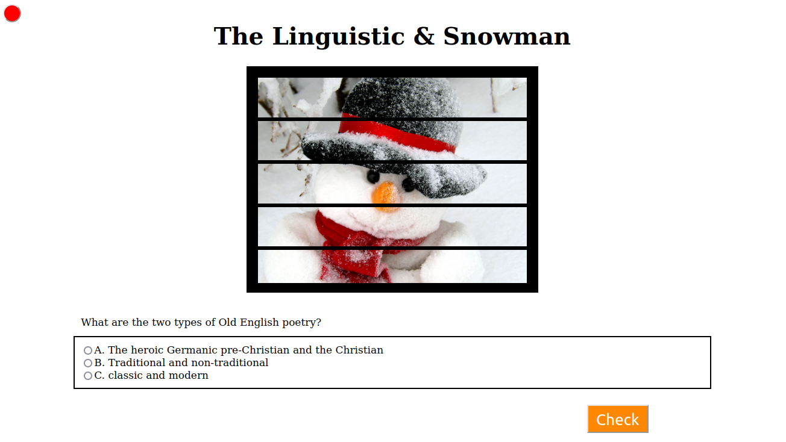

# AnimationProject1
<h3>The Game Descreption</h3> 
A linguist started his journey between the hills of ice on a freezing cold day. There is a huge difference between the lives of linguists and those of other people. In the midst of his tour, he heard clinks from behind one of the hills, but it did not interrupt his tranquility, he continued and didn't care. He was suddenly yanked from his sleeve by someone asking: Hey, what are you doing here?  He answered that linguists shouldn't be asked, they ask constantly, and they don't answer any questions about their behavior. A snowman wants to ask me a question! Isn't it scary that a snowman talks and moves? Yes, for the majority of people! Linguists, however, are used to it as it is simply normal. I think you should be scared because linguists can bring their ideas to life, and mine may be the sun itself. My apologies, Thhhheee sunnnn! master language! Language isn't who I am, I'm a linguist. It will be enough for me to forgive your mistake if and only if you answer the following three questions:
*This is the idea behiend the game and the player should answer at least three questions to pass the game otherwise they will fail in his try and they can try again.

<h3>The Programming Approach </h3> 
This game is built in js, it's a simple game therefore there is no comlex algorithms used to build this game. The programming paragdim used in this game is the functional paragdim. There are 3 functions:
    -checkAns: a void function uses to check the user's answers and remove a 
        part of the snowman picture if the answer is wrong.
        @return: -
        @parameters:
            - ans: a boolean value returned by checking if the box of the correct
            answer chose or not 
            - newquest: the next question
            - newchoices1: the first choice providede to the new question
            - newchoices2: the second choice providede to the new question
            - newchoices3: the third choice providede to the new question
    -action: a void function uses to respond to clicking the check button.
        @return: -
        @parameters: -
    -reset: This is a void function uses to respond to clicking the reset button.
        The function will return the game to the first question and return
        the full snowman's picture.
        @return: -
        @parameters: -
<h3>wireframes:  </h3>
The main page:

